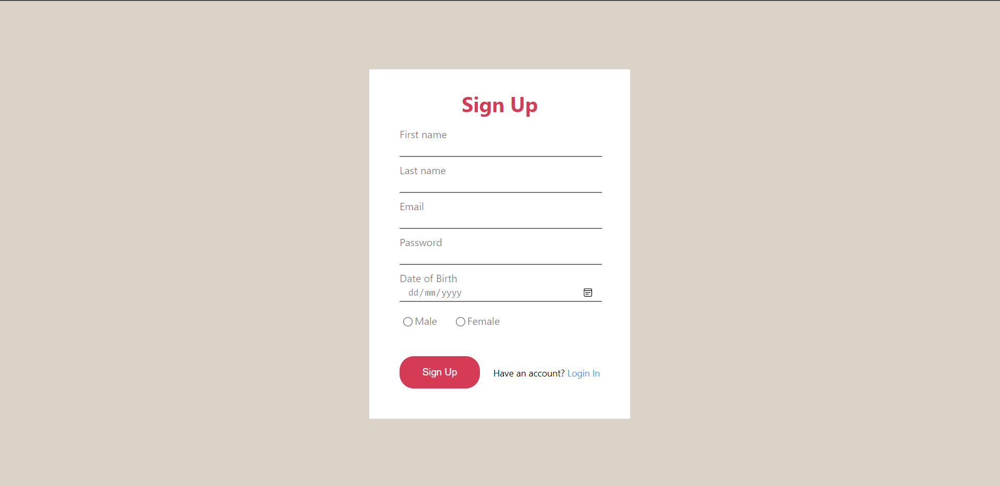
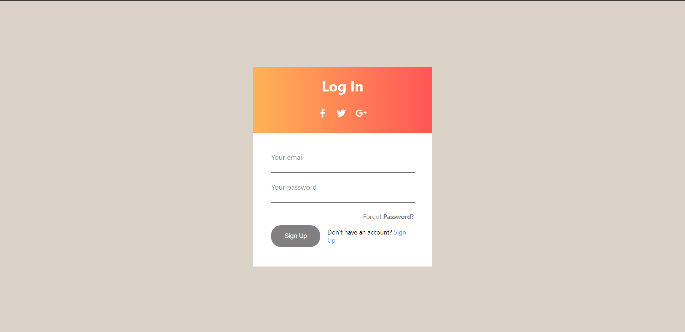

# React Form solution

## Table of contents

- [Overview](#overview)
  - [The challenge](#the-challenge)
  - [Screenshot](#screenshot)
  - [Links](#links)
- [My process](#my-process)
  - [Built with](#built-with)
  - [What I learned](#what-i-learned)
  - [Continued development](#continued-development)
  - [Useful resources](#useful-resources)
- [Author](#author)

## Overview

### The challenge

Users should be able to:

- Validate the form
- Sign in and log in
- View the optimal layout for the content depending on their device’s screen size
- See hover states for all interactive elements on the page

### Screenshot





### Links

- Solution URL: [Add solution URL here](https://github.com/adebimpecole/react-form.git)
- Live Site URL: [Add live site URL here](https://beautiful-tapioca-f14f5c.netlify.app/)

## My process

### Built with

- Semantic HTML5 markup
- CSS custom properties
- Flexbox
- Mobile-first workflow
- [React](https://reactjs.org/) - JS library

### What I learned

I learned how to validate forms and how to use conditional rendering


```js
useEffect(()=>{
    if(props.onEnter === true){

        if(radioData.gender==""){
            getgenError("Required")
        }
        
        else{
            getgenError("")
        }
    } 

    const reset = () => {        
        props.onReset("change")
    }
    reset();
},[props.onEnter])
```

### Continued development
I plan to focus more on my use of conditional rendering, the useEffect hook and the useState hook. I also want to continue honing my knowledge of child-to-parent transfer of data.

### Useful resources

- [Example resource 1](https://reactjs.org/docs/refs-and-the-dom.html) - This helped me in learning how to use conditional rendering. I really liked this pattern and will use it going forward.
- [Example resource 2](https://reactjs.org/docs/hooks-effect.html) - This is an amazing article which helped me finally understand how to use useEffect hooks. I'd recommend it to anyone still learning this concept.

## Author

- Website - [Cole Mary](https://beautiful-tapioca-f14f5c.netlify.app/)
- Frontend Mentor - [@adebimpecole](https://www.frontendmentor.io/profile/adebimpecole)
- Twitter - [@adecole02](https://twitter.com/adecole02)

